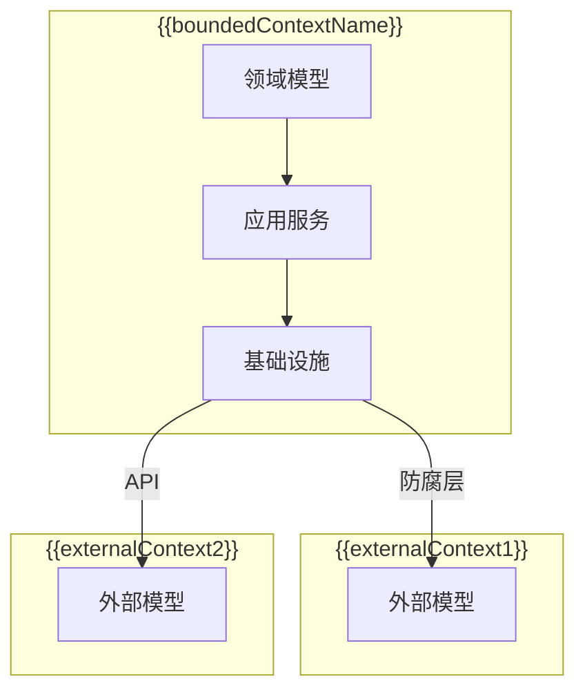

# {{serviceName}} 领域概览

**创建日期**: {{date}}  
**架构师**: {{architect}}  
**版本**: 1.0

## 概述

本文档为 {{serviceName}} 微服务的**系统级领域总览**，整合领域划分、依赖与交互、子领域映射、限界上下文、基础设施与集成、共享模块及领域术语表。单领域详细说明见各领域目录下的 `01-domain-overview.md`。

---

## 领域划分

### 领域划分图

```mermaid
graph TB
    subgraph "{{serviceName}} 微服务"
        {{domain1}}[{{domain1Name}}]
        {{domain2}}[{{domain2Name}}]
        {{domain3}}[{{domain3Name}}]
    end

    {{domain1}} -->|{{dependency1}}| {{domain2}}
    {{domain2}} -->|{{dependency2}}| {{domain3}}
```

### 业务领域列表

| 领域名称        | 领域标识      | 职责描述               | 重要性                | 详细文档                                   |
| --------------- | ------------- | ---------------------- | --------------------- | ------------------------------------------ |
| {{domain1Name}} | {{domain1Id}} | {{domain1Description}} | {{domain1Importance}} | [[../{{domain1Id}}/01-domain-overview.md]] |
| {{domain2Name}} | {{domain2Id}} | {{domain2Description}} | {{domain2Importance}} | [[../{{domain2Id}}/01-domain-overview.md]] |
| {{domain3Name}} | {{domain3Id}} | {{domain3Description}} | {{domain3Importance}} | [[../{{domain3Id}}/01-domain-overview.md]] |

### 领域职责划分

#### {{domain1Name}}

**职责**：{{domain1Responsibility1}}、{{domain1Responsibility2}}  
**边界**：✅ {{domain1InScope1}}、{{domain1InScope2}}；❌ {{domain1OutScope1}}

#### {{domain2Name}}

**职责**：{{domain2Responsibility1}}、{{domain2Responsibility2}}  
**边界**：✅ {{domain2InScope1}}、{{domain2InScope2}}；❌ {{domain2OutScope1}}

#### {{domain3Name}}

**职责**：{{domain3Responsibility1}}、{{domain3Responsibility2}}  
**边界**：✅ {{domain3InScope1}}、{{domain3InScope2}}；❌ {{domain3OutScope1}}

---

## 领域依赖与交互

### 依赖关系图

```mermaid
graph LR
    {{domain1}}[{{domain1Name}}]
    {{domain2}}[{{domain2Name}}]
    {{domain3}}[{{domain3Name}}]

    {{domain1}} -->|{{dependencyType1}}| {{domain2}}
    {{domain2}} -->|{{dependencyType2}}| {{domain3}}
```

### 依赖关系说明

| 源领域            | 目标领域          | 依赖类型            | 依赖原因              | 交互方式               |
| ----------------- | ----------------- | ------------------- | --------------------- | ---------------------- |
| {{sourceDomain1}} | {{targetDomain1}} | {{dependencyType1}} | {{dependencyReason1}} | {{interactionMethod1}} |
| {{sourceDomain2}} | {{targetDomain2}} | {{dependencyType2}} | {{dependencyReason2}} | {{interactionMethod2}} |

**依赖类型**：强依赖、弱依赖、事件依赖（通过领域事件解耦）。

### 同步调用

| 调用方领域  | 被调用方领域 | 接口类型           | 说明             |
| ----------- | ------------ | ------------------ | ---------------- |
| {{caller1}} | {{callee1}}  | {{interfaceType1}} | {{description1}} |

### 异步事件

| 发布方领域     | 订阅方领域      | 事件类型       | 说明             |
| -------------- | --------------- | -------------- | ---------------- |
| {{publisher1}} | {{subscriber1}} | {{eventType1}} | {{description1}} |

> 事件定义见各领域 02-domain-design 文档。

---

## 子领域映射

### 子领域分类

```mermaid
graph LR
    A[{{domainName}}] --> B[核心域]
    A --> C[支撑域]
    A --> D[通用域]
    B --> E[{{coreDomain1}}]
    B --> F[{{coreDomain2}}]
    C --> G[{{supportingDomain1}}]
    C --> H[{{supportingDomain2}}]
    D --> I[{{genericDomain1}}]
    D --> J[{{genericDomain2}}]
```

### 子领域详细映射

| 子领域名称     | 类型   | 描述             | 重要性          | 投资优先级    |
| -------------- | ------ | ---------------- | --------------- | ------------- |
| {{subdomain1}} | 核心域 | {{description1}} | {{importance1}} | {{priority1}} |
| {{subdomain2}} | 支撑域 | {{description2}} | {{importance2}} | {{priority2}} |
| {{subdomain3}} | 通用域 | {{description3}} | {{importance3}} | {{priority3}} |

---

## 限界上下文

### 上下文定义

**名称**：{{boundedContextName}}  
**描述**：{{boundedContextDescription}}  
**边界**：{{contextBoundary}}

### 上下文边界图



### 上下文映射关系表

| 上下文名称   | 关系类型              | 描述             | 集成方式               |
| ------------ | --------------------- | ---------------- | ---------------------- |
| {{context1}} | {{relationshipType1}} | {{description1}} | {{integrationMethod1}} |
| {{context2}} | {{relationshipType2}} | {{description2}} | {{integrationMethod2}} |
| {{context3}} | {{relationshipType3}} | {{description3}} | {{integrationMethod3}} |

### 关系类型说明

- **共享内核（SK）**：{{sharedKernelDescription}}
- **客户-供应商（C-S）**：{{customerSupplierDescription}}
- **遵奉者（Conformist）**：{{conformistDescription}}
- **防腐层（ACL）**：{{antiCorruptionLayerDescription}}
- **分离方式（Separate Ways）**：{{separateWaysDescription}}
- **发布-订阅（P-S）**：{{publishSubscribeDescription}}
- **伙伴关系（Partnership）**：{{partnershipDescription}}

### 通用语言与术语映射

| 本上下文术语   | 外部上下文术语    | 映射关系             |
| -------------- | ----------------- | -------------------- |
| {{localTerm1}} | {{externalTerm1}} | {{mappingRelation1}} |
| {{localTerm2}} | {{externalTerm2}} | {{mappingRelation2}} |

完整术语见本文档「领域术语表」章节。

### 上下文边界规则

**数据边界**：{{dataBoundary}}  
**行为边界**：{{behaviorBoundary}}  
**事务边界**：{{transactionBoundary}}

### 集成点

| 集成点           | 来源/目标上下文    | 集成方式               | 描述             |
| ---------------- | ------------------ | ---------------------- | ---------------- |
| {{inputPoint1}}  | {{sourceContext1}} | {{integrationMethod1}} | {{description1}} |
| {{outputPoint1}} | {{targetContext1}} | {{integrationMethod1}} | {{description1}} |

---

## 基础设施与集成

### 基础设施层技术工具

技术工具不属于子领域，为各子领域提供技术支持（客户-供应商关系，工具类/函数调用）。

| 工具名称         | 英文名称                   | 描述                                  | 优先级 |
| ---------------- | -------------------------- | ------------------------------------- | ------ |
| 异常处理         | Exception Handling         | 统一异常捕获、分类与处理              | P1     |
| 日志             | Logging                    | 应用与错误日志                        | P1     |
| ID 生成器        | ID Generator               | 唯一标识符（UUID、有序 ID 等）        | P1     |
| 序列化服务       | Serialization Service      | 数据序列化/反序列化（JSON、二进制等） | P1     |
| 时间服务         | Time Service               | 时区、时间格式化等                    | P2     |
| 加密服务         | Encryption Service         | 数据加解密                            | P0     |
| 数据验证工具     | Data Validation Tool       | 格式与规则验证                        | P1     |
| 资源管理工具     | Resource Management Tool   | 内存、CPU 等资源管理                  | P1     |
| 异步任务管理工具 | Async Task Management Tool | 异步任务与任务队列等                  | P0     |
| 缓存管理工具     | Cache Management Tool      | 内存缓存                              | P0     |

### 数据访问抽象

- **定位**：基础设施层抽象，提供通用接口（IRepository&lt;T&gt;、IQueryBuilder&lt;T&gt;、ITransactionManager）。
- **职责划分**：具体业务域 Repository 接口由各领域模型文档定义；本层仅提供通用抽象，实现由基础设施层完成。

### 与其他微服务的集成（如适用）

| 微服务名称        | 关系类型              | 描述             | 集成方式               |
| ----------------- | --------------------- | ---------------- | ---------------------- |
| {{microservice1}} | {{relationshipType1}} | {{description1}} | {{integrationMethod1}} |
| {{microservice2}} | {{relationshipType2}} | {{description2}} | {{integrationMethod2}} |
| {{microservice3}} | {{relationshipType3}} | {{description3}} | {{integrationMethod3}} |

### 集成策略

**同步集成**：{{synchronousIntegration}}  
**异步集成**：{{asynchronousIntegration}}  
**数据一致性**：{{dataConsistency}}

---

## 共享模块

| 模块名称          | 模块标识            | 用途                     | 使用领域               | 详细文档                                                   |
| ----------------- | ------------------- | ------------------------ | ---------------------- | ---------------------------------------------------------- |
| {{sharedModule1}} | {{sharedModule1Id}} | {{sharedModule1Purpose}} | {{sharedModule1Users}} | [[../02-shared/{{sharedModule1Id}}/01-module-overview.md]] |

> 共享模块提供跨领域技术能力；业务领域间依赖通过领域接口或领域事件实现。

---

## 领域术语表

> 本节为领域术语的**唯一来源**，其他文档中的术语应引用此处。

### 核心术语

| 术语      | 英文             | 定义            | 相关概念             |
| --------- | ---------------- | --------------- | -------------------- |
| {{term1}} | {{englishTerm1}} | {{definition1}} | {{relatedConcepts1}} |
| {{term2}} | {{englishTerm2}} | {{definition2}} | {{relatedConcepts2}} |
| {{term3}} | {{englishTerm3}} | {{definition3}} | {{relatedConcepts3}} |

### 领域实体

| 实体名称    | 英文               | 定义            | 属性            |
| ----------- | ------------------ | --------------- | --------------- |
| {{entity1}} | {{englishEntity1}} | {{definition1}} | {{attributes1}} |
| {{entity2}} | {{englishEntity2}} | {{definition2}} | {{attributes2}} |

### 领域值对象

| 值对象名称       | 英文                    | 定义            | 组成             |
| ---------------- | ----------------------- | --------------- | ---------------- |
| {{valueObject1}} | {{englishValueObject1}} | {{definition1}} | {{composition1}} |
| {{valueObject2}} | {{englishValueObject2}} | {{definition2}} | {{composition2}} |

### 领域服务

| 服务名称     | 英文                | 定义            | 职责                  |
| ------------ | ------------------- | --------------- | --------------------- |
| {{service1}} | {{englishService1}} | {{definition1}} | {{responsibilities1}} |
| {{service2}} | {{englishService2}} | {{definition2}} | {{responsibilities2}} |

### 领域事件

| 事件名称   | 英文              | 定义            | 触发条件              |
| ---------- | ----------------- | --------------- | --------------------- |
| {{event1}} | {{englishEvent1}} | {{definition1}} | {{triggerCondition1}} |
| {{event2}} | {{englishEvent2}} | {{definition2}} | {{triggerCondition2}} |

### 聚合

| 聚合名称       | 英文                  | 定义            | 聚合根             |
| -------------- | --------------------- | --------------- | ------------------ |
| {{aggregate1}} | {{englishAggregate1}} | {{definition1}} | {{aggregateRoot1}} |
| {{aggregate2}} | {{englishAggregate2}} | {{definition2}} | {{aggregateRoot2}} |

### 业务流程术语

| 术语             | 英文                    | 定义            | 使用场景           |
| ---------------- | ----------------------- | --------------- | ------------------ |
| {{processTerm1}} | {{englishProcessTerm1}} | {{definition1}} | {{usageScenario1}} |
| {{processTerm2}} | {{englishProcessTerm2}} | {{definition2}} | {{usageScenario2}} |

### 技术术语

| 术语          | 英文                 | 定义            | 技术栈         |
| ------------- | -------------------- | --------------- | -------------- |
| {{techTerm1}} | {{englishTechTerm1}} | {{definition1}} | {{techStack1}} |
| {{techTerm2}} | {{englishTechTerm2}} | {{definition2}} | {{techStack2}} |

### 术语关系图

```mermaid
graph LR
    A[{{term1}}] --> B[{{term2}}]
    A --> C[{{term3}}]
    B --> D[{{term4}}]
    C --> E[{{term5}}]
```

### 术语变更历史

| 日期     | 术语      | 变更内容 | 变更人           |
| -------- | --------- | -------- | ---------------- |
| {{date}} | {{term1}} | 初始定义 | {{domainExpert}} |

---

## 相关文档

- [[../{{domain1Id}}/01-domain-overview.md]] - {{domain1Name}} 领域概览
- [[../{{domain2Id}}/01-domain-overview.md]] - {{domain2Name}} 领域概览
- [[../{{domain3Id}}/01-domain-overview.md]] - {{domain3Name}} 领域概览
- [[../02-shared/01-overview/01-shared-modules-overview.md]] - 共享模块概览

## 变更记录

| 日期     | 版本 | 变更内容 | 变更人        |
| -------- | ---- | -------- | ------------- |
| {{date}} | 1.0  | 初始版本 | {{architect}} |
