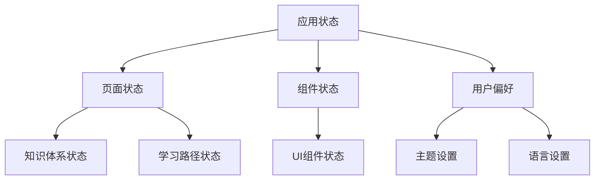

# {{serviceName}} 状态管理设计

**创建日期**: {{date}}  
**架构师**: {{architect}}  
**版本**: 1.0

## 概述

本文档描述 {{serviceName}} 的状态管理设计，包括状态管理方案、状态同步、状态持久化等。

状态管理是表现层的重要组成部分，负责管理UI状态，包括页面状态、组件状态、用户偏好等。

## 状态管理架构

### 状态管理框架

**框架名称**：{{stateManagementFramework}}  
**版本**：{{version}}  
**官方文档**：{{officialDoc}}

**选型理由**：

- **{{reason1}}**：{{reason1Description}}
- **{{reason2}}**：{{reason2Description}}
- **{{reason3}}**：{{reason3Description}}

### 状态结构



## 状态管理方案

### Provider模式

使用Provider模式管理状态：

```dart
// Provider定义示例
final knowledgeSystemProvider = StateNotifierProvider<KnowledgeSystemNotifier, KnowledgeSystemState>(
  (ref) => KnowledgeSystemNotifier(ref.read(knowledgeSystemServiceProvider)),
);
```

### 状态分类

1. **页面状态**：页面级别的状态，如列表数据、加载状态、错误状态
2. **组件状态**：组件级别的状态，如输入框值、展开/收起状态
3. **全局状态**：应用级别的状态，如用户信息、主题设置

## 状态同步

### 与应用层同步

状态与应用层数据同步：

1. **数据订阅**：订阅应用层数据变化
2. **状态更新**：应用层数据变化时更新UI状态
3. **操作触发**：UI操作触发应用层命令

### 状态持久化

状态持久化策略：

1. **本地存储**：用户偏好、设置等持久化到本地
2. **内存缓存**：临时状态保存在内存中
3. **状态恢复**：应用重启时恢复持久化状态

## 状态管理最佳实践

1. **单一数据源**：每个状态只有一个数据源
2. **不可变状态**：状态应该是不可变的
3. **状态分离**：页面状态和组件状态分离
4. **状态最小化**：只保存必要的状态

## 代码位置

### 状态管理

- **状态定义**：`apps/flutter-app/lib/presentation/state/`
- **Provider配置**：`apps/flutter-app/lib/presentation/state/providers.dart`
- **状态持久化**：`apps/flutter-app/lib/presentation/state/persistence/`

## 相关文档

- [[01-presentation-overview.md]] - 表现层概览
- [[../04-application/01-application-overview.md]] - 应用层概览

## 变更记录

| 日期 | 版本 | 变更内容 | 变更人 |
|------|------|---------|--------|
| {{date}} | 1.0 | 初始版本 | {{architect}} |

