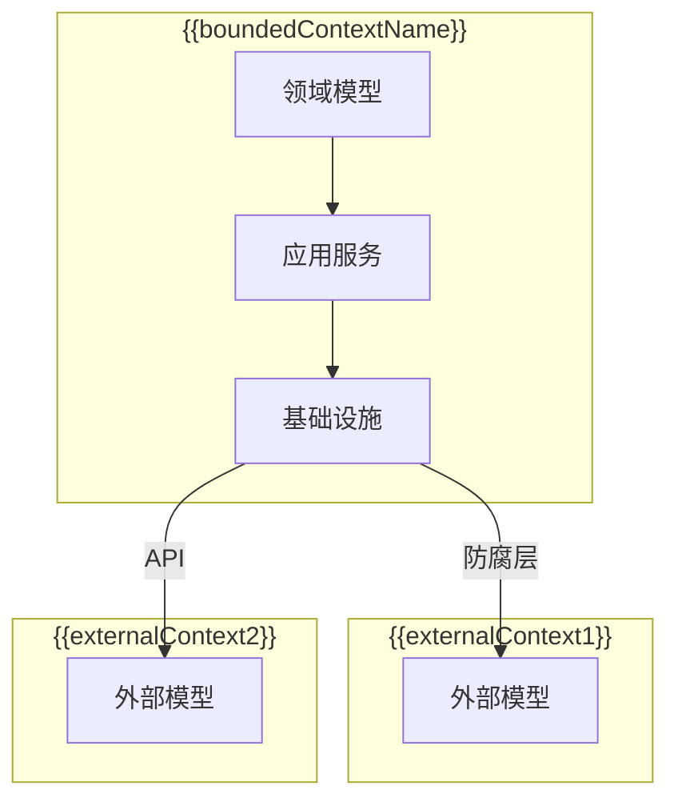

# {{serviceName}} 限界上下文

**创建日期**: {{date}}  
**领域专家**: {{domainExpert}}  
**版本**: 1.0

## 概述

本文档定义 {{serviceName}} 微服务的限界上下文（Bounded Context），包括上下文边界和上下文映射关系。

## 限界上下文定义

### 上下文名称

{{boundedContextName}}

### 上下文描述

{{boundedContextDescription}}

### 上下文边界

{{contextBoundary}}

## 上下文边界图

## 上下文映射关系

### 映射关系表

| 上下文名称 | 关系类型 | 描述 | 集成方式 |
|-----------|---------|------|---------|
| {{context1}} | {{relationshipType1}} | {{description1}} | {{integrationMethod1}} |
| {{context2}} | {{relationshipType2}} | {{description2}} | {{integrationMethod2}} |
| {{context3}} | {{relationshipType3}} | {{description3}} | {{integrationMethod3}} |

### 关系类型说明

#### 共享内核（Shared Kernel）

{{sharedKernelDescription}}

**基础设施层技术工具说明**：

基础设施层技术工具不属于限界上下文，但为所有限界上下文提供技术支持。这些工具包括：

- **异常处理**：统一的异常捕获、分类和处理机制
- **日志**：应用日志和错误日志的记录和管理
- **ID 生成器**：唯一标识符生成（UUID、有序 ID 等）
- **序列化服务**：数据序列化和反序列化（JSON、二进制等）
- **时间服务**：时间相关操作（时区处理、时间格式化等）
- **加密服务**：数据加密和解密服务
- **数据验证工具**：数据格式和规则验证工具
- **资源管理工具**：系统资源管理（内存、CPU 监控等）
- **异步任务管理工具**：异步任务执行管理
- **缓存管理工具**：内存缓存管理

所有限界上下文通过客户-供应商（C-S）关系使用这些技术工具，通过工具类或工具函数的方式调用。

**详细文档**：[[infrastructure/tools/01-tools-overview.md]] - 技术工具概览

**基础设施层数据访问抽象说明**：

数据访问抽象不属于限界上下文，而是基础设施层的抽象接口，为所有限界上下文提供通用的数据访问抽象接口支持。

**数据访问抽象**：
- **定位**：基础设施层抽象
- **职责**：提供通用抽象接口（IRepository<T>、IQueryBuilder<T>、ITransactionManager）
- **职责边界**：仅提供通用抽象接口，不定义具体业务域的Repository接口

**职责划分**：
- **数据访问抽象**：仅提供通用抽象接口，属于基础设施层抽象
- **具体业务域Repository接口**：各业务上下文定义自己的Repository接口（如 `I{{AggregateRoot1}}Repository`），属于领域层
- **Repository实现**：在基础设施层实现领域层定义的具体Repository接口

**与业务上下文的关系**：
- 各业务上下文定义自己的Repository接口（如 `I{{AggregateRoot1}}Repository`、`I{{AggregateRoot2}}Repository`）
- 具体Repository接口可能继承或使用通用抽象接口（IRepository<T>）
- 基础设施层实现具体的Repository接口，使用通用抽象接口提供的功能

**详细文档**：[[infrastructure/data-access/01-data-access-abstraction.md]] - 数据访问抽象设计

#### 客户-供应商（Customer-Supplier）

{{customerSupplierDescription}}

#### 遵奉者（Conformist）

{{conformistDescription}}

#### 防腐层（Anti-Corruption Layer）

{{antiCorruptionLayerDescription}}

#### 分离方式（Separate Ways）

{{separateWaysDescription}}

#### 发布-订阅（Publish-Subscribe）

{{publishSubscribeDescription}}

#### 伙伴关系（Partnership）

{{partnershipDescription}}

## 通用语言（Ubiquitous Language）

> **说明**：详细的领域术语定义请参考 [[glossary.md]] 文档。本文档仅描述上下文特定的术语映射关系。

### 术语映射

不同上下文之间可能存在概念相似但术语不同的情况，需要建立术语映射关系：

| 本上下文术语 | 外部上下文术语 | 映射关系 |
|------------|--------------|---------|
| {{localTerm1}} | {{externalTerm1}} | {{mappingRelation1}} |
| {{localTerm2}} | {{externalTerm2}} | {{mappingRelation2}} |

> 完整的领域术语表请参考 [[glossary.md]] 文档。

## 上下文边界规则

### 数据边界

{{dataBoundary}}

### 行为边界

{{behaviorBoundary}}

### 事务边界

{{transactionBoundary}}

## 集成点

### 输入集成点

| 集成点 | 来源上下文 | 集成方式 | 描述 |
|--------|-----------|---------|------|
| {{inputPoint1}} | {{sourceContext1}} | {{integrationMethod1}} | {{description1}} |
| {{inputPoint2}} | {{sourceContext2}} | {{integrationMethod2}} | {{description2}} |

### 输出集成点

| 集成点 | 目标上下文 | 集成方式 | 描述 |
|--------|-----------|---------|------|
| {{outputPoint1}} | {{targetContext1}} | {{integrationMethod1}} | {{description1}} |
| {{outputPoint2}} | {{targetContext2}} | {{integrationMethod2}} | {{description2}} |

## 相关文档

- [[domain-overview.md]] - 领域概览
- [[subdomain-mapping.md]] - 子领域映射
- [[glossary.md]] - 领域术语表（术语的唯一来源）
- [[infrastructure/01-infrastructure-overview.md]] - 基础设施层概览
- [[infrastructure/tools/01-tools-overview.md]] - 技术工具概览

## 变更记录

| 日期 | 版本 | 变更内容 | 变更人 |
|------|------|----------|--------|
| {{date}} | 1.0 | 初始版本 | {{domainExpert}} |

