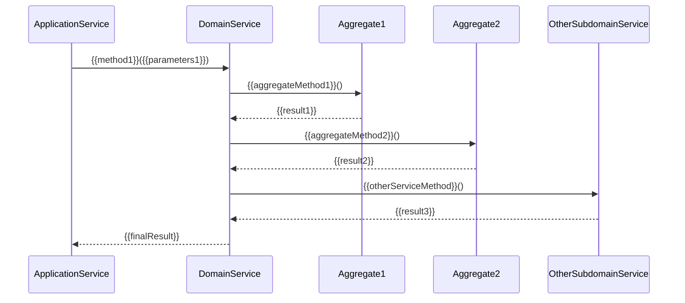

# {{subdomainName}} 领域服务设计

**创建日期**: {{date}}  
**领域专家**: {{domainExpert}}  
**版本**: 1.0

## 概述

本文档描述 {{subdomainName}} 子领域中的领域服务（Domain Services）设计，包括服务列表、接口定义、实现说明、依赖关系和跨领域协作。

> **说明**: 领域服务封装不属于任何聚合的业务逻辑，可以协调多个聚合完成业务用例，也可以调用其他子领域的服务实现跨领域协作。

## 领域服务列表

| 服务名称 | 英文名称 | 职责 | 所属聚合/子领域 | 分类 |
|---------|---------|------|----------------|------|
| {{service1}} | {{englishName1}} | {{responsibility1}} | {{aggregateOrSubdomain1}} | {{category1}} |
| {{service2}} | {{englishName2}} | {{responsibility2}} | {{aggregateOrSubdomain2}} | {{category2}} |

### 服务分类说明

- **核心服务**：实现子领域核心业务逻辑的服务
- **支撑服务**：为其他服务提供支撑能力的服务
- **协调服务**：协调多个聚合或跨领域协作的服务

## 领域服务详细说明

### {{service1}}

#### 服务描述

{{serviceDescription1}}

#### 服务职责

{{serviceResponsibilities1}}

#### 服务接口定义

| 方法名称 | 参数 | 返回值 | 描述 | 业务规则 |
|---------|------|--------|------|---------|
| {{method1}} | {{parameters1}} | {{returnType1}} | {{description1}} | {{businessRule1}} |
| {{method2}} | {{parameters2}} | {{returnType2}} | {{description2}} | {{businessRule2}} |

#### 接口示例

```typescript
interface {{Service1}} {
  {{method1}}({{parameters1}}): Promise<{{returnType1}}>;
  {{method2}}({{parameters2}}): Promise<{{returnType2}}>;
}
```

#### 服务实现说明

{{implementationDescription1}}

#### 业务规则和约束

{{businessRulesAndConstraints1}}

#### 使用场景

{{usageScenarios1}}

### {{service2}}

#### 服务描述

{{serviceDescription2}}

#### 服务职责

{{serviceResponsibilities2}}

#### 服务接口定义

| 方法名称 | 参数 | 返回值 | 描述 | 业务规则 |
|---------|------|--------|------|---------|
| {{method3}} | {{parameters3}} | {{returnType3}} | {{description3}} | {{businessRule3}} |

## 服务依赖关系

### 依赖关系图

```mermaid
graph TB
    subgraph "{{subdomainName}}"
        A[{{service1}}]
        B[{{service2}}]
        C[{{aggregate1}}]
        D[{{aggregate2}}]
    end
    subgraph "其他子领域"
        E[{{otherSubdomainService1}}]
        F[{{otherSubdomainService2}}]
    end
    
    A --> C
    A --> D
    A --> E
    B --> A
    B --> F
```

### 服务间依赖

| 服务名称 | 依赖的服务 | 依赖类型 | 描述 |
|---------|-----------|---------|------|
| {{service1}} | {{dependencyService1}} | {{dependencyType1}} | {{description1}} |
| {{service2}} | {{dependencyService2}} | {{dependencyType2}} | {{description2}} |

### 服务对聚合的依赖

| 服务名称 | 依赖的聚合 | 依赖方式 | 描述 |
|---------|-----------|---------|------|
| {{service1}} | {{aggregate1}} | {{dependencyMethod1}} | {{description1}} |
| {{service2}} | {{aggregate2}} | {{dependencyMethod2}} | {{description2}} |

### 服务对其他子领域服务的依赖

| 服务名称 | 依赖的其他子领域服务 | 所属子领域 | 依赖方式 | 描述 |
|---------|-------------------|-----------|---------|------|
| {{service1}} | {{otherSubdomainService1}} | {{otherSubdomain1}} | {{dependencyMethod1}} | {{description1}} |
| {{service2}} | {{otherSubdomainService2}} | {{otherSubdomain2}} | {{dependencyMethod2}} | {{description2}} |

## 跨领域协作

### 协作关系图

```mermaid
graph LR
    subgraph "{{subdomainName}}"
        A[{{service1}}]
        B[{{service2}}]
    end
    subgraph "{{otherSubdomain1}}"
        C[{{otherSubdomainService1}}]
    end
    subgraph "{{otherSubdomain2}}"
        D[{{otherSubdomainService2}}]
    end
    
    A -->|调用| C
    A -->|调用| D
    B -->|调用| C
```

### 跨领域服务调用

| 本子领域服务 | 调用的其他子领域服务 | 所属子领域 | 调用场景 | 协作模式 | 描述 |
|------------|-------------------|-----------|---------|---------|------|
| {{service1}} | {{otherSubdomainService1}} | {{otherSubdomain1}} | {{callScenario1}} | {{collaborationMode1}} | {{description1}} |
| {{service2}} | {{otherSubdomainService2}} | {{otherSubdomain2}} | {{callScenario2}} | {{collaborationMode2}} | {{description2}} |

### 协作模式说明

#### 同步调用

{{synchronousCallDescription}}

- **适用场景**：需要立即获取结果的业务逻辑
- **一致性要求**：强一致性或最终一致性
- **错误处理**：同步异常处理

#### 异步调用

{{asynchronousCallDescription}}

- **适用场景**：可以异步处理的业务逻辑
- **一致性要求**：最终一致性
- **错误处理**：异步重试机制

#### 事件驱动

{{eventDrivenDescription}}

- **适用场景**：解耦的业务逻辑，通过领域事件触发
- **一致性要求**：最终一致性
- **错误处理**：事件重放机制

### 协作协议

#### 接口契约

{{interfaceContract}}

#### 数据格式

{{dataFormat}}

#### 错误处理

{{errorHandling}}

## 服务设计原则

### 无状态原则

领域服务应该是无状态的，不保存业务状态：

{{statelessPrinciple}}

### 接口定义原则

领域服务通过接口定义，便于测试和替换：

{{interfaceDefinitionPrinciple}}

### 测试和替换原则

领域服务应该易于测试，支持依赖注入和替换：

{{testabilityPrinciple}}

## 服务调用流程

### 典型调用流程



## 相关文档

- [[domain-model.md]] - 领域模型（包含领域服务概览）
- [[aggregates.md]] - 聚合根详细说明
- [[domain-events.md]] - 领域事件定义
- [[use-cases.md]] - 业务用例
- [[../../subdomain-mapping.md]] - 子领域映射（领域级别的协作关系）

## 变更记录

| 日期 | 版本 | 变更内容 | 变更人 |
|------|------|----------|--------|
| {{date}} | 1.0 | 初始版本 | {{domainExpert}} |

