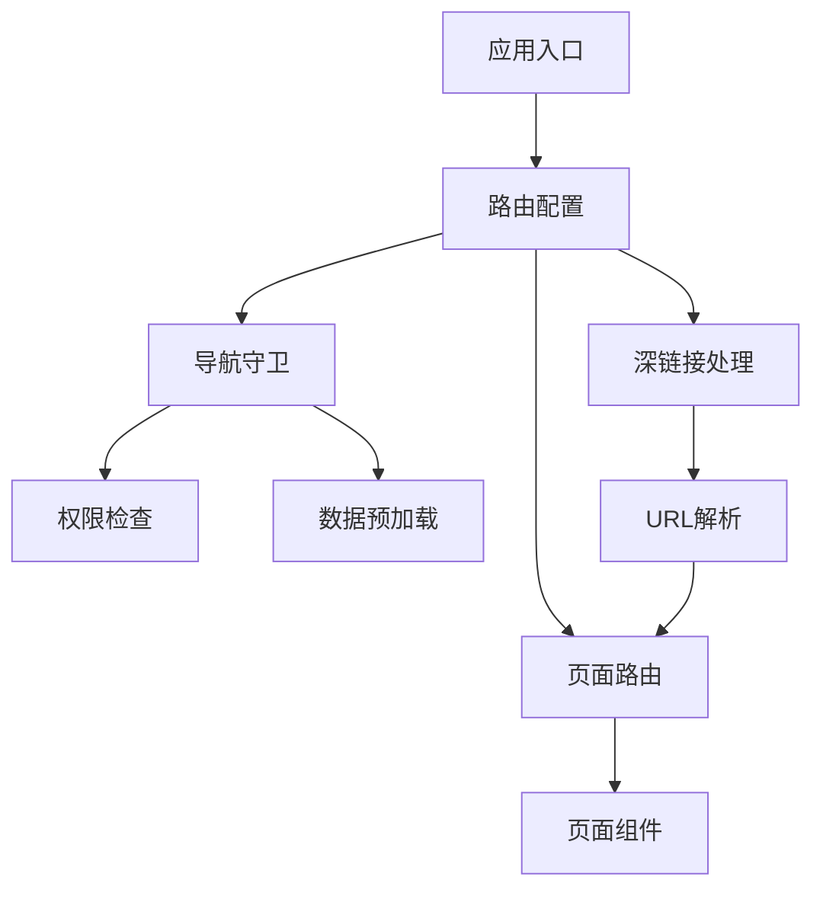

# {{serviceName}} 路由设计

**创建日期**: {{date}}  
**架构师**: {{architect}}  
**版本**: 1.0

## 概述

本文档描述 {{serviceName}} 的路由设计，包括路由配置、导航守卫、深链接支持等。

路由管理是表现层的重要组成部分，负责处理页面导航、路由跳转、参数传递等。

## 路由架构

### 路由框架

**框架名称**：{{routingFramework}}  
**版本**：{{version}}  
**官方文档**：{{officialDoc}}

**选型理由**：

- **{{reason1}}**：{{reason1Description}}
- **{{reason2}}**：{{reason2Description}}
- **{{reason3}}**：{{reason3Description}}

### 路由结构



## 路由配置

### 路由定义

```dart
// 路由配置示例
final routes = [
  Route(
    path: '/',
    name: 'home',
    component: HomePage,
  ),
  Route(
    path: '/knowledge-system',
    name: 'knowledgeSystem',
    component: KnowledgeSystemPage,
    children: [
      Route(
        path: '/list',
        component: KnowledgeSystemListPage,
      ),
      Route(
        path: '/:id',
        component: KnowledgeSystemDetailPage,
      ),
    ],
  ),
];
```

### 路由参数

| 参数类型 | 说明 | 示例 |
|---------|------|------|
| 路径参数 | URL路径中的参数 | `/knowledge-system/:id` |
| 查询参数 | URL查询字符串中的参数 | `/knowledge-system?id=123` |
| 状态参数 | 通过状态传递的参数 | `navigate('/page', state: {...})` |

## 导航守卫

### 守卫类型

1. **全局前置守卫**：在路由跳转前执行，用于权限检查、数据预加载等
2. **路由前置守卫**：在特定路由跳转前执行
3. **路由后置守卫**：在路由跳转后执行，用于日志记录、分析等

### 守卫实现

```dart
// 导航守卫示例
class AuthGuard implements RouteGuard {
  @override
  Future<bool> canActivate(RouteContext context) async {
    // 检查用户是否已登录
    final isAuthenticated = await authService.isAuthenticated();
    if (!isAuthenticated) {
      // 重定向到登录页
      context.redirect('/login');
      return false;
    }
    return true;
  }
}
```

## 深链接支持

### 深链接格式

```
{{appScheme}}://{{path}}?{{queryParams}}
```

### 深链接处理

1. **URL解析**：解析深链接URL，提取路径和参数
2. **路由匹配**：匹配对应的路由配置
3. **参数传递**：将参数传递给目标页面
4. **页面跳转**：执行页面跳转

## 路由状态管理

### 路由状态

路由状态包括：

- 当前路由路径
- 路由参数
- 路由历史记录
- 导航状态

### 状态同步

路由状态与应用层状态同步：

- 路由变化时更新应用层状态
- 应用层状态变化时更新路由

## 代码位置

### 路由配置

- **路由定义**：`apps/flutter-app/lib/presentation/routing/routes.dart`
- **路由守卫**：`apps/flutter-app/lib/presentation/routing/guards/`
- **深链接处理**：`apps/flutter-app/lib/presentation/routing/deep_link_handler.dart`

## 相关文档

- [[01-presentation-overview.md]] - 表现层概览
- [[../04-application/01-application-overview.md]] - 应用层概览
- [[../02-product/ux-design.md]] - 用户体验设计

## 变更记录

| 日期 | 版本 | 变更内容 | 变更人 |
|------|------|---------|--------|
| {{date}} | 1.0 | 初始版本 | {{architect}} |

