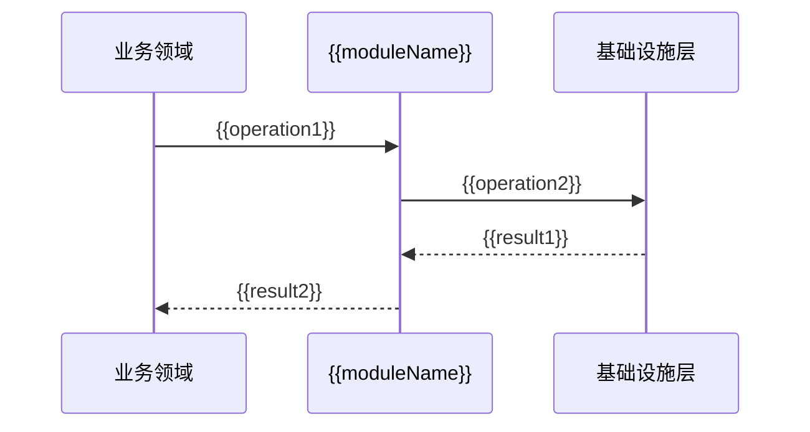

# {{serviceName}} {{moduleName}} 模块概览

**创建日期**: {{date}}  
**架构师**: {{architect}}  
**版本**: 1.0

## 概述

本文档描述 {{serviceName}} 的 {{moduleName}} 共享模块设计，包括模块说明、接口设计、实现架构、使用方式等。

{{moduleName}} 是跨领域的技术性共享能力，提供{{moduleDescription}}，不包含业务逻辑，可以被多个业务领域复用。

## 模块定义

### 模块名称

{{moduleName}}

### 模块描述

{{moduleDescription}}

### 模块定位

{{moduleName}} 是**技术性共享模块**，主要负责：

- {{moduleResponsibility1}}
- {{moduleResponsibility2}}
- {{moduleResponsibility3}}

### 模块边界

**{{moduleName}} 包含**：

- ✅ {{moduleContains1}}
- ✅ {{moduleContains2}}
- ✅ {{moduleContains3}}

**{{moduleName}} 不包含**：

- ❌ {{moduleExcludes1}}
- ❌ {{moduleExcludes2}}
- ❌ {{moduleExcludes3}}

## 架构设计

### 架构定位

{{moduleName}} 在系统架构中的位置：

```
┌─────────────────────────────────────┐
│  业务领域层                          │
│  使用 {{moduleName}} 提供的技术能力   │
└──────────────┬──────────────────────┘
               │ 调用
┌──────────────▼──────────────────────┐
│  {{moduleName}}                      │
│  提供技术能力                         │
└──────────────┬──────────────────────┘
               │ 使用
┌──────────────▼──────────────────────┐
│  基础设施层                          │
│  技术工具、数据访问等                 │
└─────────────────────────────────────┘
```

### 设计原则

{{moduleName}} 遵循以下设计原则：

- **技术导向**：纯粹的技术实现，不包含业务逻辑
- **接口抽象**：通过接口定义提供技术能力，隐藏实现细节
- **可替换性**：实现可以被替换，不影响业务逻辑
- **高性能**：{{performanceRequirement}}
- **可扩展性**：支持{{extensionRequirement}}

## 接口设计

### 核心接口

#### {{interface1}}

{{interface1Description}}

```{{language}}
{{interface1Code}}
```

**接口方法**：

| 方法名称    | 参数              | 返回值            | 描述                   | 异常                 |
| ----------- | ----------------- | ----------------- | ---------------------- | -------------------- |
| {{method1}} | {{method1Params}} | {{method1Return}} | {{method1Description}} | {{method1Exception}} |
| {{method2}} | {{method2Params}} | {{method2Return}} | {{method2Description}} | {{method2Exception}} |

#### {{interface2}}

{{interface2Description}}

```{{language}}
{{interface2Code}}
```

**接口方法**：

| 方法名称    | 参数              | 返回值            | 描述                   | 异常                 |
| ----------- | ----------------- | ----------------- | ---------------------- | -------------------- |
| {{method3}} | {{method3Params}} | {{method3Return}} | {{method3Description}} | {{method3Exception}} |
| {{method4}} | {{method4Params}} | {{method4Return}} | {{method4Description}} | {{method4Exception}} |

### 接口契约

**前置条件**：

- {{method1}}: {{precondition1}}
- {{method2}}: {{precondition2}}

**后置条件**：

- {{method1}}: {{postcondition1}}
- {{method2}}: {{postcondition2}}

**不变式**：

- {{invariant1}}
- {{invariant2}}

## 实现架构

### 核心组件

#### {{component1}}

{{component1Description}}

**职责**：

- {{component1Responsibility1}}
- {{component1Responsibility2}}
- {{component1Responsibility3}}

**实现要点**：

- {{component1Implementation1}}
- {{component1Implementation2}}

#### {{component2}}

{{component2Description}}

**职责**：

- {{component2Responsibility1}}
- {{component2Responsibility2}}
- {{component2Responsibility3}}

**实现要点**：

- {{component2Implementation1}}
- {{component2Implementation2}}

### 数据流

{{moduleName}} 的数据流：



### 技术栈

{{moduleName}} 使用的技术栈：

#### 核心库和框架

- **核心库**：{{coreLibrary}}

  - 版本：{{coreLibraryVersion}}
  - 优势：{{coreLibraryAdvantages}}
  - 官方文档：{{coreLibraryDocs}}

- **框架/库**：{{frameworkLibrary}}
  - 版本：{{frameworkLibraryVersion}}
  - 用途：{{frameworkLibraryUsage}}
  - 官方文档：{{frameworkLibraryDocs}}

#### 依赖库

- **依赖 1**：{{dependency1}}
  - 版本：{{dependency1Version}}
  - 用途：{{dependency1Usage}}
- **依赖 2**：{{dependency2}}
  - 版本：{{dependency2Version}}
  - 用途：{{dependency2Usage}}

#### 技术选型理由

1. **成熟稳定**：{{maturityReason}}
2. **性能优秀**：{{performanceReason}}
3. **功能完整**：{{functionalityReason}}
4. **生态丰富**：{{ecosystemReason}}
5. **{{additionalReason}}**：{{additionalReasonDescription}}

## 使用方式

### 初始化

{{moduleName}} 的初始化方式：

```{{language}}
{{initializationCode}}
```

### 基本使用

#### 使用场景 1：{{useCase1}}

```{{language}}
{{useCase1Code}}
```

#### 使用场景 2：{{useCase2}}

```{{language}}
{{useCase2Code}}
```

### 最佳实践

- {{bestPractice1}}
- {{bestPractice2}}
- {{bestPractice3}}

## 性能考虑

### 性能指标

- **吞吐量**：{{throughput}}
- **延迟**：{{latency}}
- **资源消耗**：{{resourceConsumption}}

### 性能优化

- {{optimization1}}
- {{optimization2}}
- {{optimization3}}

## 错误处理

### 错误类型

| 错误类型       | 错误码         | 描述                  | 处理方式           |
| -------------- | -------------- | --------------------- | ------------------ |
| {{errorType1}} | {{errorCode1}} | {{errorDescription1}} | {{errorHandling1}} |
| {{errorType2}} | {{errorCode2}} | {{errorDescription2}} | {{errorHandling2}} |

### 异常处理

{{exceptionHandlingDescription}}

## 测试策略

### 单元测试

{{unitTestDescription}}

### 集成测试

{{integrationTestDescription}}

### 性能测试

{{performanceTestDescription}}

## 代码位置

### 代码结构

```
{{codeLocation}}/
├── src/
│   ├── {{mainFile}}
│   ├── {{component1File}}
│   └── {{component2File}}
└── {{configFile}}
```

### 关键文件

- **{{mainFile}}**：{{mainFileDescription}}
- **{{component1File}}**：{{component1FileDescription}}
- **{{component2File}}**：{{component2FileDescription}}

## 相关文档

- [[../overview/01-shared-modules-overview.md]] - 共享模块概览
- [[../../infrastructure/01-infrastructure-overview.md]] - 基础设施层概览
- [[../../01-overview/01-service-overview.md]] - 服务概览（业务与系统上下文）
- [[../../01-overview/02-architecture.md]] - 架构概览（技术栈与选型）

## 变更记录

| 日期     | 版本 | 变更内容 | 变更人        |
| -------- | ---- | -------- | ------------- |
| {{date}} | 1.0  | 初始版本 | {{architect}} |
