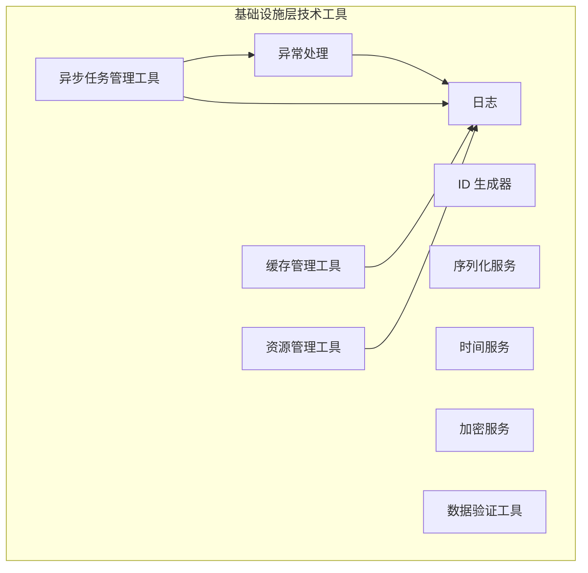

# 技术工具概览

**创建日期**: {{date}}  
**架构师**: {{architect}}  
**版本**: 1.0

## 概述

本文档描述 {{serviceName}} 微服务的技术工具概览，包括所有工具的分类、用途、设计原则和工具列表。

技术工具属于基础设施层，提供纯粹的技术工具能力，与业务无关，可以被任何系统复用。这些工具不包含业务概念，是纯粹的技术实现，通常以工具类或工具函数的形式提供。

## 技术工具定义

### 架构定位

技术工具属于**基础设施层**，提供基础设施级别的技术能力，支持领域层和应用层的功能实现。

### 工具特点

技术工具具有以下特点：

- **技术导向**：纯粹的技术实现，不包含业务逻辑
- **可复用性**：可以被多个子领域和业务场景复用
- **独立性**：工具之间相互独立，可以单独使用
- **标准化**：提供统一的接口和实现规范
- **无状态性**：工具应该是无状态的，不保存业务状态，保证线程安全

### 工具边界

技术工具包含以下类型的工具：

- 异常处理和错误管理
- 日志记录和管理
- 标识符生成
- 数据序列化和反序列化
- 时间处理和服务
- 数据加密和安全
- 数据验证
- 资源管理
- 异步任务管理
- 缓存管理

**边界外**：
- 业务逻辑（属于领域层）
- 数据持久化（属于基础设施层的数据访问）
- UI 组件（属于表现层）

## 工具分类

### 核心工具（P0 优先级）

| 工具名称 | 英文名称 | 描述 | 优先级 |
|---------|---------|------|--------|
| 异常处理 | Exception Handling | 统一的异常捕获、分类和处理机制，支持异常恢复和错误报告 | P0 |
| 日志 | Logging | 应用日志和错误日志的记录和管理 | P0 |
| ID 生成器 | ID Generator | 唯一标识符生成，包括 UUID、有序 ID 等 | P0 |
| 序列化服务 | Serialization Service | 数据序列化和反序列化，支持 JSON、二进制等格式 | P0 |
| 加密服务 | Encryption Service | 数据加密和解密服务，保护敏感数据 | P0 |
| 数据验证工具 | Data Validation Tool | 数据格式和规则验证工具 | P0 |
| 异步任务管理工具 | Async Task Management | 异步任务执行管理，包括 Dart Isolate 池管理、任务队列等 | P0 |
| 缓存管理工具 | Cache Management | 内存缓存管理，提升数据访问性能 | P0 |

### 支撑工具（P1-P2 优先级）

| 工具名称 | 英文名称 | 描述 | 优先级 |
|---------|---------|------|--------|
| 资源管理工具 | Resource Management | 系统资源管理，包括内存、CPU 监控和管理 | P1 |
| 时间服务 | Time Service | 时间相关操作，包括时区处理、时间格式化等 | P2 |

## 工具列表

### 异常处理（Exception Handling）

**描述**：统一的异常捕获、分类和处理机制，支持异常恢复和错误报告。

**主要功能**：
- 异常分类和层次结构
- 异常恢复策略
- 错误日志记录
- 异常上下文信息管理

**详细设计**：[[02-exception-handling.md]]

### 日志（Logging）

**描述**：应用日志和错误日志的记录和管理。

**主要功能**：
- 多级别日志记录（DEBUG、INFO、WARN、ERROR）
- 日志格式化
- 日志输出目标（控制台、文件、远程服务）
- 日志轮转和归档

**详细设计**：[[03-logging.md]]

### ID 生成器（ID Generator）

**描述**：唯一标识符生成，包括 UUID、有序 ID 等。

**主要功能**：
- UUID 生成（v1、v4）
- 有序 ID 生成（雪花算法、数据库序列）
- 分布式 ID 生成
- ID 格式化和验证

**详细设计**：[[04-id-generator.md]]

### 序列化服务（Serialization Service）

**描述**：数据序列化和反序列化，支持 JSON、二进制等格式。

**主要功能**：
- JSON 序列化/反序列化
- 二进制序列化
- 自定义序列化器
- 类型安全和验证

**详细设计**：[[05-serialization-service.md]]

### 时间服务（Time Service）

**描述**：时间相关操作，包括时区处理、时间格式化等。

**主要功能**：
- 时区转换
- 时间格式化
- 时间计算和比较
- 时间戳处理

**详细设计**：[[06-time-service.md]]

### 加密服务（Encryption Service）

**描述**：数据加密和解密服务，保护敏感数据。

**主要功能**：
- 对称加密（AES）
- 非对称加密（RSA）
- 哈希算法（SHA、MD5）
- 密钥管理

**详细设计**：[[07-encryption-service.md]]

### 数据验证工具（Data Validation Tool）

**描述**：数据格式和规则验证工具。

**主要功能**：
- 数据类型验证
- 格式验证（邮箱、URL、正则表达式）
- 范围验证
- 自定义验证规则

**详细设计**：[[08-data-validation-tool.md]]

### 资源管理工具（Resource Management）

**描述**：系统资源管理，包括内存、CPU 监控和管理。

**主要功能**：
- 内存使用监控
- CPU 使用监控
- 资源限制和配额
- 资源清理和回收

**详细设计**：[[09-resource-management.md]]

### 异步任务管理工具（Async Task Management）

**描述**：异步任务执行管理，包括 Dart Isolate 池管理、任务队列等。

**主要功能**：
- Isolate 池管理
- 任务队列管理
- 任务调度和优先级
- 任务状态跟踪

**详细设计**：[[10-async-task-management.md]]

### 缓存管理工具（Cache Management）

**描述**：内存缓存管理，提升数据访问性能。

**主要功能**：
- 内存缓存
- 缓存策略（LRU、LFU、FIFO）
- 缓存过期和失效
- 缓存统计和监控

**详细设计**：[[11-cache-management.md]]

## 设计原则

### 1. 单一职责原则

每个工具只负责一个明确的功能领域，避免功能重叠和耦合。

### 2. 接口抽象原则

工具通过接口定义，支持依赖注入和替换实现。

### 3. 无状态原则

工具应该是无状态的，不保存业务状态，保证线程安全。

### 4. 可配置原则

工具的行为应该通过配置进行定制，而不是硬编码。

### 5. 可测试原则

工具应该易于单元测试，支持模拟和桩实现。

### 6. 性能优先原则

工具的实现应该考虑性能影响，避免成为系统瓶颈。

### 7. 错误处理原则

工具应该提供清晰的错误信息和异常处理机制。

## 工具依赖关系

### 依赖关系图

### 工具间依赖

| 工具名称 | 依赖的工具 | 依赖类型 | 描述 |
|---------|-----------|---------|------|
| 异常处理 | 日志 | 必需 | 异常信息需要记录到日志 |
| 异步任务管理工具 | 异常处理 | 必需 | 异步任务异常需要统一处理 |
| 异步任务管理工具 | 日志 | 必需 | 任务执行日志需要记录 |
| 缓存管理工具 | 日志 | 可选 | 缓存操作日志记录 |
| 资源管理工具 | 日志 | 可选 | 资源监控日志记录 |

## 使用场景

### 领域层使用

领域层可以使用技术工具来支持领域逻辑的实现：

- 使用 ID 生成器生成聚合根 ID
- 使用数据验证工具验证值对象
- 使用时间服务处理时间相关的业务规则

### 应用层使用

应用层可以使用技术工具来支持应用服务的实现：

- 使用异常处理统一处理应用层异常
- 使用日志记录应用层操作
- 使用序列化服务处理数据传输

### 基础设施层使用

基础设施层可以使用技术工具来支持基础设施的实现：

- 使用加密服务保护敏感数据
- 使用资源管理工具监控系统资源
- 使用缓存管理工具提升性能

## 相关文档

- [[02-exception-handling.md]] - 异常处理工具设计
- [[03-logging.md]] - 日志工具设计
- [[04-id-generator.md]] - ID 生成器工具设计
- [[05-serialization-service.md]] - 序列化服务工具设计
- [[06-time-service.md]] - 时间服务工具设计
- [[07-encryption-service.md]] - 加密服务工具设计
- [[08-data-validation-tool.md]] - 数据验证工具设计
- [[09-resource-management.md]] - 资源管理工具设计
- [[10-async-task-management.md]] - 异步任务管理工具设计
- [[11-cache-management.md]] - 缓存管理工具设计
- [[../01-infrastructure-overview.md]] - 基础设施层概览
- [[../../overview/01-domain-overview.md]] - 领域概览

## 变更记录

| 日期 | 版本 | 变更内容 | 变更人 |
|------|------|----------|--------|
| {{date}} | 1.0 | 初始版本 | {{architect}} |

