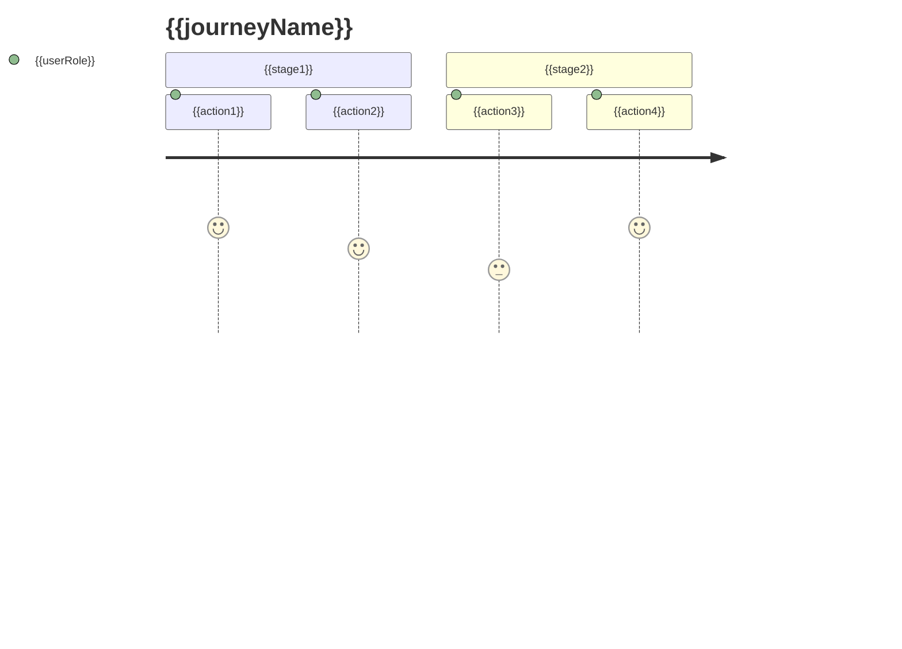

# {{serviceName}} 用户故事

**创建日期**: {{date}}  
**产品经理**: {{productManager}}  
**版本**: {{version}}

## 文档说明

本文档描述 {{serviceName}} 的用户故事和用户旅程，从用户视角描述产品功能和使用场景。

## 用户故事列表

### 核心用户故事

| 故事ID | 用户故事 | 优先级 | 验收标准 |
|--------|---------|--------|---------|
| US-001 | 作为 {{userRole1}}，我希望 {{action1}}，以便 {{benefit1}} | {{priority1}} | {{acceptanceCriteria1}} |
| US-002 | 作为 {{userRole2}}，我希望 {{action2}}，以便 {{benefit2}} | {{priority2}} | {{acceptanceCriteria2}} |

### 用户故事详细说明

#### US-001: {{storyTitle1}}

**用户角色**: {{userRole}}

**用户故事**: 作为 {{userRole}}，我希望 {{action}}，以便 {{benefit}}

**背景**: {{background}}

**场景**:
- 场景1: {{scenario1}}
- 场景2: {{scenario2}}

**验收标准**:
- [ ] {{criteria1}}
- [ ] {{criteria2}}

**相关功能**: [[features.md#feature-xxx]]

## 用户旅程

### 主要用户旅程

#### 旅程1: {{journeyName1}}

**用户角色**: {{userRole}}

**目标**: {{journeyGoal}}

**旅程步骤**:

1. **阶段**: {{stage1}}
   - 用户行为: {{userAction1}}
   - 系统响应: {{systemResponse1}}
   - 用户感受: {{userFeeling1}}

2. **阶段**: {{stage2}}
   - 用户行为: {{userAction2}}
   - 系统响应: {{systemResponse2}}
   - 用户感受: {{userFeeling2}}

**痛点**: {{painPoints}}

**机会点**: {{opportunities}}

### 用户旅程地图

## 用户场景

### 场景1: {{scenarioName1}}

**场景描述**: {{scenarioDescription}}

**参与者**: {{participants}}

**前置条件**: {{preconditions}}

**主要流程**:
1. {{step1}}
2. {{step2}}
3. {{step3}}

**后置条件**: {{postconditions}}

**异常流程**: {{exceptionFlow}}

## 相关文档

- [[product-overview.md]] - 产品概览
- [[prd.md]] - 产品需求文档
- [[features.md]] - 功能规格说明
- [[../03-domain/use-cases.md]] - 业务用例（领域视角）

## 变更记录

| 日期 | 版本 | 变更内容 | 变更人 |
|------|------|----------|--------|
| {{date}} | {{version}} | 初始版本 | {{productManager}} |

